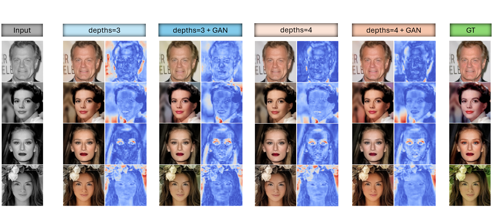
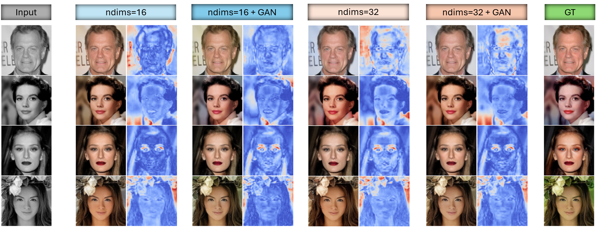

# Image Colorization on CelebA-HQ Dataset
This project focuses on **Image Colorization** for human face images, primarily using a **U-Net** architecture, while also exploring the use of **PatchGAN** to potentially enhance the realism and overall visual quality of the generated colorized images.
## Architecture
The model is based on a U-Net architecture (see the figure below) inspired by **UVCGAN** [1] and **Attention U-Net** [2].
<p align="center">
    
</p>

## Experiments
The training process was configured with the following settings:: 
```python
# Training configuration
epoch = 100, batch_size = 64
# Loss weights
alpha = 100.0, beta = 10.0, theta = 0.2
# Optimizer
optimizer = Adam(lr=0.0002, betas=(0.5, 0.999))
```
*All experiments below are compared against a baseline model configured with **ndims=16**, **depth=3**, and **num_blocks=1***.\
The following results illustrate how changing the depth of the U-Net—i.e., using different numbers of encoder/decoder levels:
<div align="center">

|  Model | $\mathbf{FID}_{Lab}\downarrow$ | $\mathbf{SSIM}_{Lab}\uparrow$ | $\mathbf{PSNR}_{Lab}\uparrow$ | $\Delta\mathbf{CF}_{Lab}\downarrow$ |
| :--: | :--: | :--: |:--: | :--: |
| *U-Net(depth=3)* | $11.2756^{\scriptscriptstyle 3}$ | $0.9621^{\scriptscriptstyle 2}$ | $24.8939^{\scriptscriptstyle 2}$ | $7.4858^{\scriptscriptstyle 4}$ |
| *U-Net(depth=3) + GAN*| $9.8024^{\scriptscriptstyle 1}$ | $0.9608^{\scriptscriptstyle 3}$ | $24.6041^{\scriptscriptstyle 4}$| $7.1987^{\scriptscriptstyle 3}$|
|  *U-Net(depth=4)*  | $12.4752^{\scriptscriptstyle 4}$ | $0.9623^{\scriptscriptstyle 1}$ | $25.0431^{\scriptscriptstyle 1}$| $6.9875^{\scriptscriptstyle 2}$ |
| *U-Net(depth=4) + GAN* | $10.0764^{\scriptscriptstyle 2}$ | $0.9604^{\scriptscriptstyle 4}$ | $24.8296^{\scriptscriptstyle 3}$ | $6.6017^{\scriptscriptstyle 1}$|

**Table 1:** Effect of U-Net depth and GAN on Colorization Performance
</div>
<p align="center">
    
</p>

<p align="center"><b>Image 1:</b> Colorization results of U-Net variants with different depths and GAN</p>
The following results demonstrate the impact of modifying the U-Net’s width:
<div align="center">

|  Model | $\mathbf{FID}_{Lab}\downarrow$ | $\mathbf{SSIM}_{Lab}\uparrow$ | $\mathbf{PSNR}_{Lab}\uparrow$ | $\Delta\mathbf{CF}_{Lab}\downarrow$ |
| :--: | :--: | :--: |:--: | :--: |
| *U-Net(ndims=16)* | $11.2756^{\scriptscriptstyle 4}$ | $0.9621^{\scriptscriptstyle 3}$ | $24.8939^{\scriptscriptstyle 3}$ | $7.4858^{\scriptscriptstyle 4}$ |
| *U-Net(ndims=16) + GAN*| $9.8024^{\scriptscriptstyle 1}$ | $0.9608^{\scriptscriptstyle 4}$ | $24.6041^{\scriptscriptstyle 4}$| $7.1987^{\scriptscriptstyle 3}$|
|  *U-Net(ndims=32)*  | $11.0218^{\scriptscriptstyle 3}$ | $0.9632^{\scriptscriptstyle 1}$ | $24.9895^{\scriptscriptstyle 1}$| $6.9626^{\scriptscriptstyle 2}$ |
| *U-Net(ndims=32) + GAN* | $10.4226^{\scriptscriptstyle 2}$ | $0.9629^{\scriptscriptstyle 2}$ | $24.9446^{\scriptscriptstyle 2}$ | $6.7582^{\scriptscriptstyle 1}$|

**Table 2:** Influence of U-Net feature width and GAN integration on Image Colorization quality
</div>
<p align="center">
    
</p>
<p align="center"><b>Image 2:</b> Results from U-Net models of different feature widths, with and without GAN support</p>

*Several experiments were conducted to evaluate different design choices in the colorization process. Two key observations emerged:*
* **Color space comparison**: Predicting *ab* channels from *L* yields better colorization results than directly predicting *RGB* values.
* **Loss function evaluation**: When comparing reconstruction losses, the *L1 loss* led to notice
* **Adversarial loss (PatchGAN)**: Incorporating a *PatchGAN discriminato* further improves perceptual quality, leading to lower *FID scores* and more realistic colorizations.
## References
[1] **Dmitrii Torbunov**, **Yi Huang**, **Haiwang Yu**, **Jin Huang**,
 **Shinjae Yoo**, **Meifeng Lin**, **Brett Viren**, **Yihui Ren** (2022).\
 *UVCGAN: UNetVision Transformer cycle-consistent GAN for unpaired image-to-image translation*. [[arXiv]](https://arxiv.org/pdf/2203.02557)\
[2] **Ozan Oktay**, **Jo Schlemper**, **Loic Le Folgoc**, **Matthew Lee**, **Mattias Heinrich**, **Kazunari Misawa**, **Kensaku Mori**, **Steven McDonagh**, **Nils Y Hammerla**, **Bernhard Kainz**, **Ben Glocker**, **Daniel Rueckert** (2018).\
*Attention U-Net: Learning Where to Look for the Pancreas*. [[arXiv]](https://arxiv.org/pdf/1804.03999)