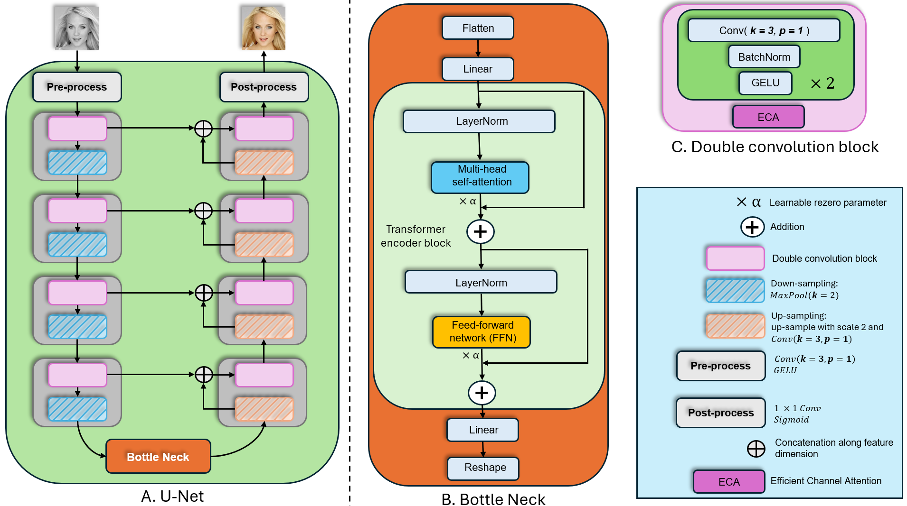
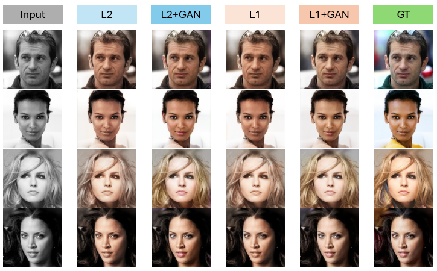

# Image Colorization on CelebA-HQ Dataset
This project focuses on **Image colorization** for human face images, primarily using a **U-Net** architecture to generate realistic and visually appealing colorized results.
## Architecture
The model is based on a U-Net architecture (see the figure below) inspired by **UVCGAN** [1] and **Attention U-Net** [2].
<p align="center">
    
</p>

## Experiments
The training process was configured with the following settings:: 
```python
# Training configuration
epoch = 120, batch_size = 64
# Loss weights
alpha = 100.0, beta = 1.0, theta = 0.08
# Optimizer
optimizer = Adam(lr=0.0002, betas=(0.5, 0.999))
```
The results below are obtained using the same model architecture *(**ndims=16**, **num_blocks=1**)* with only the loss functions varying.
<div align="center">

|  Loss Function | $\mathbf{PSNR}_{Lab}\uparrow$ | $\mathbf{SSIM}_{Lab}\uparrow$ |
| :--: | :--: | :--: |
| $\alpha\mathcal{L}_2 + \beta\mathcal{L}_{percept}$ | $25.1490^{\scriptscriptstyle 3}$ | $0.9630^{\scriptscriptstyle 3}$ |
| $\alpha\mathcal{L}_2 + \beta\mathcal{L}_{percept} + \theta\mathcal{L}_{G}$| $24.8835^{\scriptscriptstyle 4}$ | $0.9595^{\scriptscriptstyle 4}$ |
| $\alpha\mathcal{L}_1 + \beta\mathcal{L}_{percept}$  | $25.2308^{\scriptscriptstyle 1}$ | $0.9640^{\scriptscriptstyle 1}$ |
| $\alpha\mathcal{L}_1 + \beta\mathcal{L}_{percept} + \theta\mathcal{L}_{G}$ | $25.1886^{\scriptscriptstyle 2}$ | $0.9632^{\scriptscriptstyle 2}$ |

</div>
<p align="center">
    
</p>

*Several experiments were conducted to evaluate different design choices in the colorization process. Two key observations emerged:*
* **Color space comparison**: Predicting *ab* channels from *L* yields better colorization results than directly predicting *RGB* values.
* **Loss function evaluation**: When comparing reconstruction losses, the *L1 loss* led to noticeably better colorization quality than *L2*.
## References
[1] **Dmitrii Torbunov**, **Yi Huang**, **Haiwang Yu**, **Jin Huang**,
 **Shinjae Yoo**, **Meifeng Lin**, **Brett Viren**, **Yihui Ren** (2022).\
 *UVCGAN: UNetVision Transformer cycle-consistent GAN for unpaired image-to-image translation*. [[arXiv]](https://arxiv.org/pdf/2203.02557)\
[2] **Ozan Oktay**, **Jo Schlemper**, **Loic Le Folgoc**, **Matthew Lee**, **Mattias Heinrich**, **Kazunari Misawa**, **Kensaku Mori**, **Steven McDonagh**, **Nils Y Hammerla**, **Bernhard Kainz**, **Ben Glocker**, **Daniel Rueckert** (2018).\
*Attention U-Net: Learning Where to Look for the Pancreas*. [[arXiv]](https://arxiv.org/pdf/1804.03999)